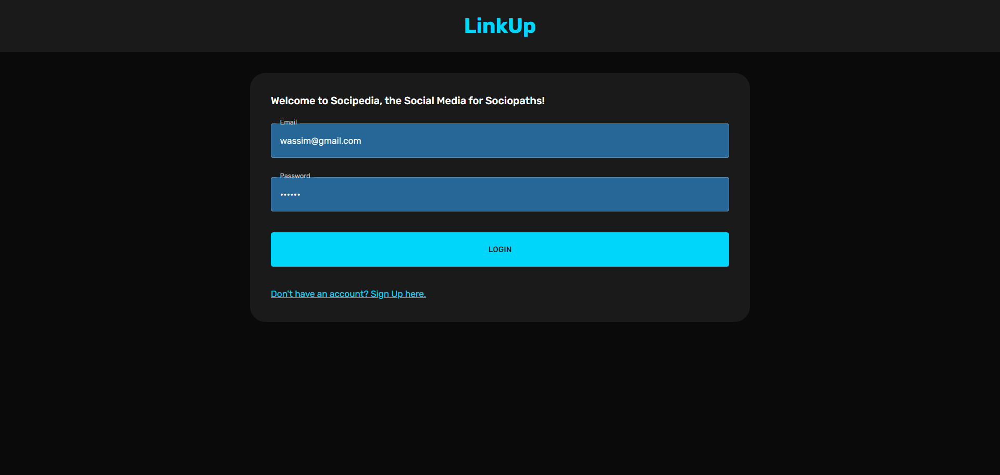
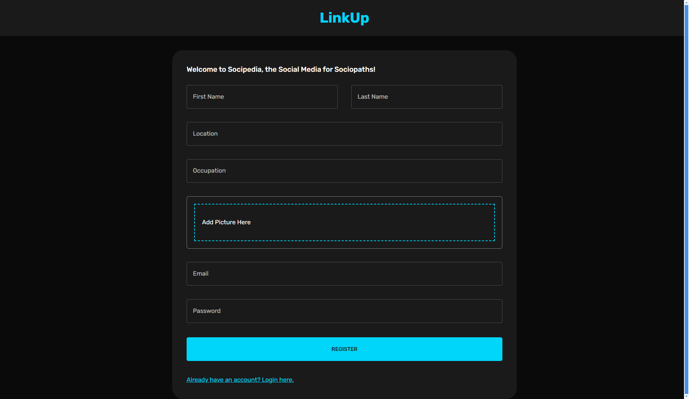
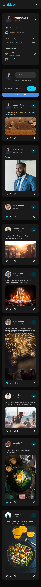
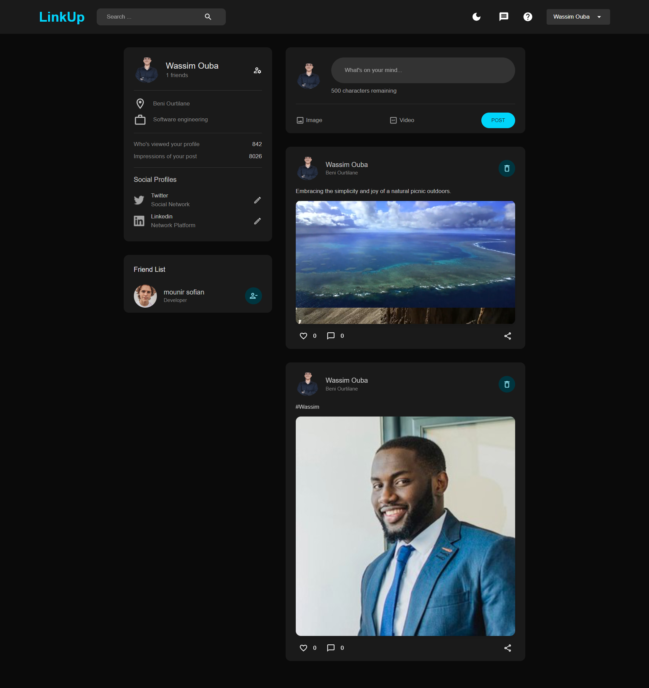
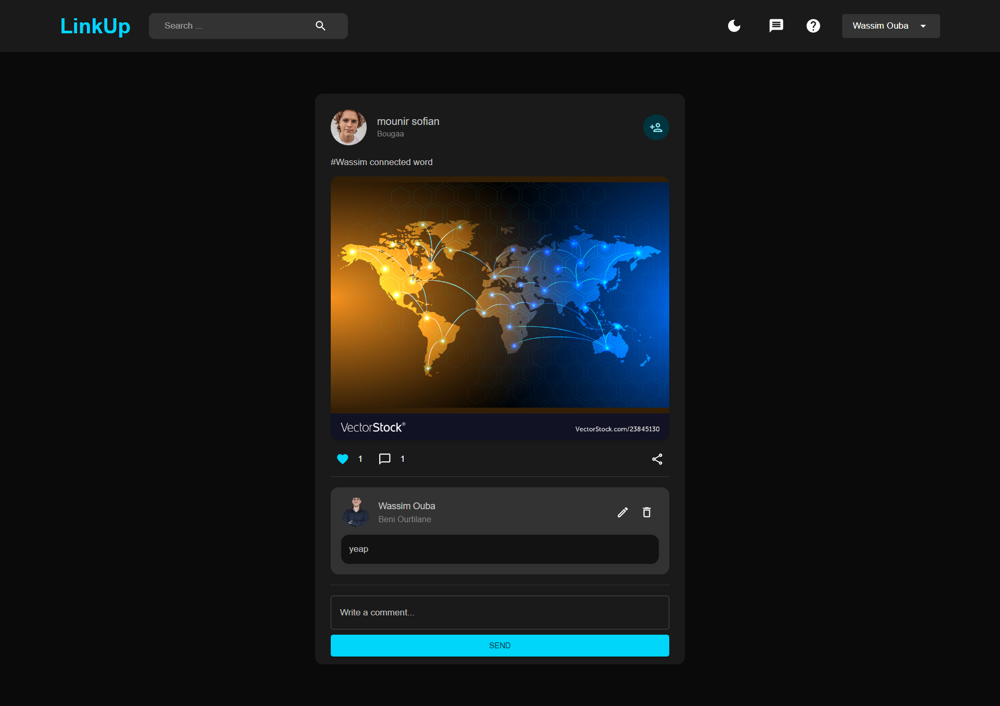
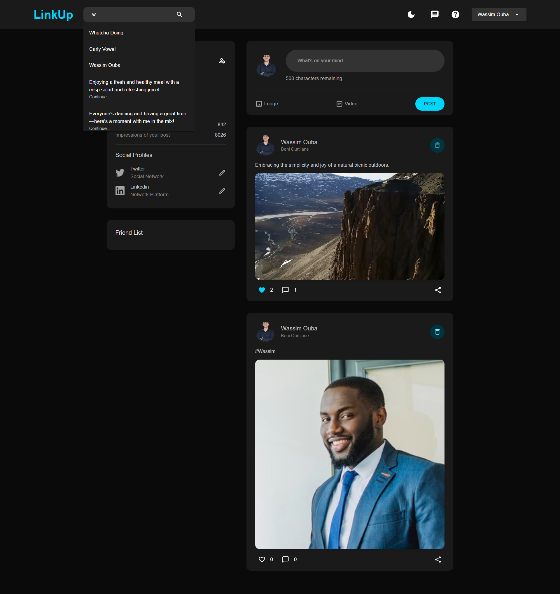
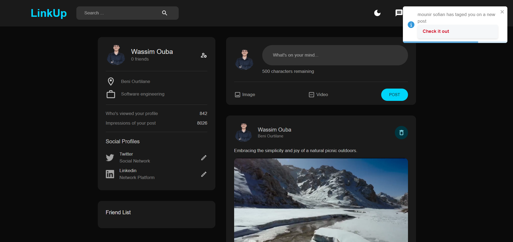
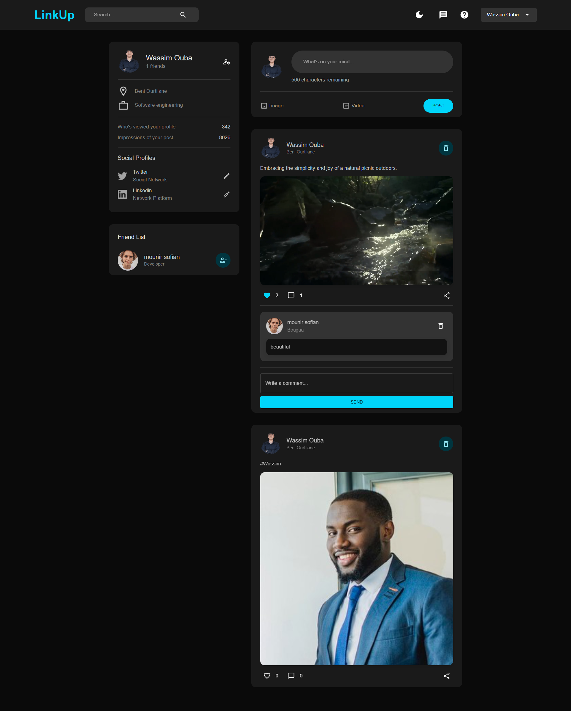

#### Social Media Application

#### ========================

### Overview

### --------

This application is a social media platform built with the MERN stack (MongoDB, Express.js, React.js, Node.js). It allows users to create profiles, share posts, like and comment on others' posts, and more. The platform includes features such as image/video uploads, post tagging, and system notifications for new posts and tags.

### Optional Features

- **Follow System:** Users can follow each other.
- **Notifications:** Users receive notifications for new interactions and tagged posts.
- **Trending Content:** Explore trending posts and users.

### Features

### --------

- **User Authentication:** Secure user registration and login.
- **Profile Management:** Users can create, update, and manage their profiles.
- **Post Sharing:** Share text, images, and videos in posts.
- **Post Interaction:** Like and comment on posts.
- **Tagging:** Tag users in posts to enhance engagement.
- **Responsive Design:** Fully responsive UI compatible with various devices.
- **Notifications:** Real-time notifications for new posts and interactions.

### Installation

### ------------

### Prerequisites

- Node.js and npm installed.
- MongoDB database setup (local or cloud).

### Frontend Setup

1.  **Navigate to the client directory:**

    ```bash
    cd client
    ```

2.  **Install dependencies:**

    ```bash
    npm install
    ```

3.  **Start the client application:**

    ```bash
    npm start
    ```

### Backend Setup

1.  **Navigate to the server directory:**

    ```bash
    cd server
    ```

2.  **Install dependencies:**

    ```bash
    npm install
    ```

3.  **Create a `.env` file in the `server` directory and add the following environment variables:**

    env

    ```bash
    MONGO_URL=your_mongodb_connection_string
    PORT=5000
    JWT_SECRET= your_secret_key
    ```

4.  **Start the server application:**

    ```bash
    npm start
    ```

## API Documentation

### User Routes

- **Get User:** `GET /users/:id`

  - Retrieves user information by user ID.

- **Get User Friends:** `GET /users/:id/friends`

  - Retrieves a list of friends for a specific user.

- **Add/Remove Friend:** `PATCH /users/:id/:friendId`

  - Adds or removes a friend from the user's friend list.

- **Search Users:** `GET /users/search/:search`

  - Searches for users by name or email.

### Post Routes

- **Get Feed Posts:** `GET /posts`

  - Retrieves a feed of posts.

- **Get User Posts:** `GET /posts/:userId`

  - Retrieves posts created by a specific user.

- **Get One Post:** `GET /posts/:id`

  - Retrieves a specific post by ID.

- **Create Post:** `POST /posts`

  - Creates a new post, supporting image and video uploads.

- **Create Post Profile:** `POST /posts/profile`

  - Creates a new profile post.

- **Like Post:** `PATCH /posts/:id/like`

  - Likes a specific post.

- **Add Comment:** `POST /posts/:id/comment`

  - Adds a comment to a specific post.

- **Edit Comment:** `PATCH /posts/:postId/comments/:commentId`

  - Edits a comment on a post.

- **Delete Comment:** `DELETE /posts/:postId/comments/:commentId`

  - Deletes a comment from a post.

- **Delete Post:** `DELETE /posts/:id`

  - Deletes a specific post.

- **Delete Post Profile:** `DELETE /posts/:postId/:userId`

  - Deletes a post from a user's profile.

- **Search Functionality:** `GET /posts/best/search`

  - Searches for posts or users.

### Authentication Routes

- **Register:** `POST /auth/register`
  - Registers a new user, including profile picture upload.
- **Login:** `POST /auth/login`
  - Authenticates a user and provides a JWT token.

### Screenshots

### -----------

### Login Page


_Description: The login screen where users can enter their credentials to access the application._

### Signup Page


_Description: The signup screen where new users can create an account._

### Home Page


_Description: The home screen showing posts from users._

### Responsive Design


_Description: A view of the application on a mobile device, demonstrating responsive design._

### Profile Page


_Description: The user profile page where users can view and edit their information._

### Post Page


_Description: The post page showing a single post with comments and likes._

### Search Page


_Description: The search page allowing users to find posts or users._

### Notifications


_Description: The notifications panel showing recent activities and messages._

### Bonus Page


_Description: The bonus page showing comment content and users._

### Usage

### -----

- **User Registration:** Users can sign up using the registration form, providing details such as name, email, password, and optionally, a profile picture.

- **User Login:** Registered users can log in to access their profiles and interact with posts.

- **Creating Posts:** Users can create posts with text, images, or videos. They can also **tag** other users in their posts.

- **Interacting with Posts:** Users can like and comment on posts. Comments can be edited or deleted by the author.

- **Notifications:** Users receive real-time notifications for new posts and when they are tagged in posts.

## Development

### Running Locally

1.  **Clone the repository:**

````bash
 git clone https://github.com/your-repo/social-media-app.git
 cd social-media-app
 ```

2.  **Setup the frontend and backend as described in the Installation section.**
  ```bash
 cd client
 npm install
 npm start
 ```
 ```bash
 cd server
 npm install
 npm start
 ```

3.  **Navigate to the `client` and `server` directories and follow the setup instructions to start both applications.**

### Contributing

-   **Fork the repository** and create a new branch for your changes.
-   **Make your modifications** and test them thoroughly.
-   **Submit a pull request** with a description of your changes.

License
-------

This project is licensed under the MIT License - see the LICENSE file for details.
````

### Made with ❤️ by [Wassim Oubaziz](https://www.linkedin.com/in/wassim-oubaziz/) for [PRODIGY intership]
